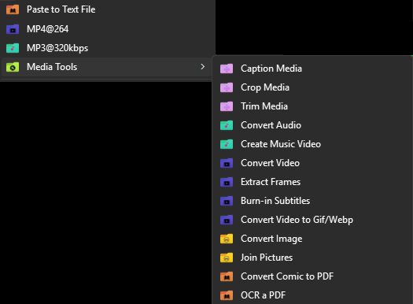

# 🛠️ Zhiro QuickTools

A bunch of `.bat` scripts to handle mundane, repetitive media tasks (conversions, trimming, captioning, etc.) with a single click.

I made these to use with my **Right Click Menu** (Context Menu), but they work just as well via the Windows **SendTo** folder. No fancy GUIs, just drag, drop, and done.

## ⚡ The Quick List

### 📀 Mixed Media
* **CAPTION4ALL:** Add meme-style captions or text overlays to pictures or videos.
* **CROP4ALL:** Smart cropping and padding (16:9, 1:1, etc.) for pictures or videos.
* **TRIM4ALL:** Trim video/audio files (Precise re-encode or Fast stream copy).

### 🎵 Audio
* **EXTRACT320:** One-click extraction to MP3 320kbps (No UI).
* **CONV4AUDIO:** Smart converter (MP3, Opus, FLAC).
* **SONG2VID:** Create a video from an audio file (uses embedded art or local images).
* **GAIN4SONG:** Permanently applies ReplayGain volume adjustments directly to the audio stream.

### 🎥 Video
* **VID2x264:** One click converter to H.264/AAC. WhatsApp friendly (No UI).
* **CONV4VID:** Multi-format video converter (MP4, WebM) with resolution resizing.
* **VIDEMUX:** Universal demuxer to extract audio, video, subtitles, and fonts from MKV/MP4 files.
* **HARDSUB4VID:** Burn subtitles (SRT/ASS) into video.
* **VID2GIFWEBP:** Create optimized GIFs or WebPs from video.
* **FRAMES4ALL:** Extract frames from video or explode GIFs/WebPs.
  
### 🖼️ Image
* **PIC2ALL:** Convert images to PNG, WebP, ICO, or JPG.
* **JOINVERT:** Join multiple images vertically or horizontally.

### 📄 Docs & Utils
* **PASTE2FILE:** Instantly saves your clipboard text to a timestamped `.txt` file.
* **OCRPDF:** Add searchable text layers to PDFs (requires Python).
* **COMIC2PDF:** Convert CBZ/CBR to PDF (and vice-versa).
* **UPDATER:** Native self-updater that fetches and installs the latest version of this suite directly from GitHub.

---

## 📖 Script Details & Usage

Click on a script name to see what it does.

### 📀 Mixed Media Tools

<strong>Universal Caption Tool (CAPTION4ALL.bat)</strong>

* **What it does:** Adds text to media.
* **Usage:** Adds subtitles/captions with customizable background box, font, and position, works for both pictures (includes some presets) and videos.

<strong>Smart Crop & Fill (CROP4ALL.bat)</strong>

* **What it does:** Crops images/videos or fills the background to match a ratio (1:1, 16:9, etc.).
* **Usage:** Send a file.
    * *Video:* Input manual crop percentage.
    * *Image:* Choose presets (Square, Portrait, Landscape) or manual crop.

<strong>Media Trimmer (TRIM4ALL.bat)</strong>

* **What it does:** Cuts audio or video files.
* **Usage:** Send a file.
    * *Precise Mode:* Re-encodes the file (frame accurate).
    * *Fast Mode:* Type `copy` to just slice the file without re-encoding (extremely fast, but cuts on keyframes).

### 🎵 Audio Tools

<strong>Quick MP3 Extract (extract320.bat)</strong>

* **What it does:** Bruteforce extraction/conversion to MP3 320kbps.
* **Usage:** Send file. No menu. Silent execution.

<strong>Smart Audio Converter (CONV4AUDIO.bat)</strong>

* **What it does:** Converts audio files to MP3, Opus, or FLAC.
* **Usage:** Send files. Choose format.
    * *Note:* FLAC option only appears if input is WAV.

<strong>Audio to Video (SONG2VID.bat)</strong>

* **What it does:** Turns an MP3/FLAC into an MP4 video (for song sharing to video-only platforms).
* **Logic:**
    1.  Looks for embedded cover art.
    2.  Looks for `folder.jpg` or same-name image in the folder.
    3.  Looks for animations (`.gif`/`.webp`) to loop.
    4.  Falls back to a default image (comes in the package).

<strong>Permanent ReplayGain Applicator (GAIN2SONG.bat)</strong>

* **What it does:** Normal audio players read ReplayGain tags to adjust volume on the fly. This script reads those tags and *permanently* burns that volume adjustment into the audio file itself (useful for dumb players, car stereos, or video editors that ignore ReplayGain tags).
* **Usage:** Send audio files. By default, it automatically applies the TRACK gain without asking.
* **Pro-tip:** If you open the `.bat` file with a text editor and change `AUTO_START_TRACK=1` to `0`, it will show a menu allowing you to choose Album Gain or Auto-Normalize (EBU R128) for files that have no tags.

### 🎥 Video Tools

<strong>Quick Video Converter (VID2x264.bat)</strong>

* **What it does:** Forces a video into standard H.264 + AAC format to ensure compatibility with older devices and Whatsapp web.
* **Usage:** Just send the file. No menu, fully automatic.

<strong>Multi-Format Converter (CONV4VID.bat)</strong>

* **What it does:** Converts videos to MP4 (H.264) or WebM (VP9).
* **Usage:** Send a video file. A menu asks for the target format and resolution (1080p, 720p, 480p, etc.).

<strong>Universal Demuxer (VIDEMUX.bat)</strong>

* **What it does:** Extracts (demuxes) the individual streams from a video container without re-encoding. 
* **Usage:** Send a video file (MKV/MP4). A menu will ask if you want to extract *Everything* (Raw Video stream, all Audio tracks, all Subtitles, and attached Fonts) or *Just Subtitles/Fonts* (super handy for quickly grabbing subs).
* **Output:** Creates a neatly organized folder right next to your source file containing all the extracted tracks.

<strong>Hardsub Burner (HARDSUB4VID.bat)</strong>

* **What it does:** Burns subtitles permanently into the video.
* **Usage:** Send a video.
    * It automatically looks for a matching `.srt` or `.ass` file.
    * If none found, it scans for internal subtitle tracks.
    * Lets you choose font styles (Cinema Yellow, Simple White, Custom).

<strong>Frame Extractor (FRAMES4ALL.bat)</strong>

* **What it does:** Dumps every frame of a video/gif into a folder.
* **Usage:** Send file. It handles GIF coalescing automatically (so frames aren't garbled).

<strong>Animation Converter (VID2GIFWEBP.bat)</strong>

* **What it does:** Turns short videos into high-quality GIFs or efficient WebPs.
* **Usage:** Send video(s). Choose format (GIF/WebP) and optional FPS/Quality settings.

### 🖼️ Image Tools

<strong>Image Converter (PIC2ALL.bat)</strong>

* **What it does:** Converts images to PNG, WebP, ICO (multisize), or JPG.
* **Usage:** Send image(s). Select output format from the menu.

<strong>Smart Image Joiner (JOINVERT.bat)</strong>

* **What it does:** Stitches multiple images together cleanly through a very caveman-like way (the only way i was able to make it work with bat files). Calling joinvert.ps1 and joinvert_real.bat
* **Usage:** Select multiple images -> Send to script.
    * Asks if you want to join them Vertically (Tall) or Horizontally (Wide).
    * Automatically resizes width/height to match the largest image.

### 📄 Docs & Utils

<strong>Paste to File (PASTE2FILE.bat)</strong>

* **What it does:** Grabs whatever text is in your clipboard and saves it to a `.txt` file in the current folder.
* **Usage:** Run it inside the folder where you want the file (via Right Click background).

<strong>PDF OCR Enabler (OCRPDF.bat)</strong>

* **What it does:** Adds a selectable text layer to scanned PDFs.
* **Requirement:** Requires Python and `pip install ocrmypdf`.
* **Usage:** Send PDF. Wait for it to finish.

<strong>Comic Converter (COMIC2PDF.bat)</strong>

* **What it does:** Converts Comic Books (.CBR/.CBZ) to PDF and vice-versa.
* **Usage:** Send file. It automatically detects direction (Archive -> PDF or PDF -> Archive).

<strong>Suite Updater (UPDATER.bat)</strong>

* **What it does:** Automatically checks the GitHub repository for a newer version of Zhiro QuickTools. If an update is found, it downloads and replaces your local files automatically.
* **Usage:** Just double-click it (no drag-and-drop needed). It uses native Windows tools (`curl` and `tar`), so it requires zero setup.
* **Note:** This requires the `version.txt` file to be present in your folder to know which version you are currently running. If you modified a script, back it up before updating!

---

## 📦 Requirements

These scripts rely on command-line tools. You need to have these added to your Windows **PATH**.

* **[FFmpeg](https://ffmpeg.org/download.html)** (Essential for all Video/Audio tools)
* **[ImageMagick](https://imagemagick.org/script/download.php)** (Essential for Image/PDF tools)
* **[7-Zip](https://www.7-zip.org/)** (Required for COMIC2PDF)
* **Python** + `pip install ocrmypdf` (Only for OCRPDF.bat)
* **[MediaInfo](https://mediaarea.net/en/MediaInfo/Download/Windows)** (Recommended for accurate FPS detection in animations)

## 📥 Installation

Download the latest Release, unzip it to a safe folder (e.g., `C:\Tools\ZhiroQuickTools`). Then choose your method:

### Method 1: Easy Context Menu (Recommended)
This is how I use them. It allows for a cleaner menu with custom icons (included in the repo).
1.  [Download](https://www.sordum.org/downloads/?easy-context-menu) and open **Easy Context Menu**.
2.  Open the **List Editor** (Mouse icon).
3.  Drag and drop the `.bat` files into the desired menu (e.g., "Context Menu").
4.  Assign the included icons if you want to be fancy.
5.  I leave the silent scripts outside the submenu for quicker access (VID2x264.bat,extract320.bat on files, paste2file.bat on explorer)
6.  Save changes.

*(This is how my setup looks using the icons included in the pack)*

### Method 2: "SendTo" Folder (Native)
1.  Press `Win + R` and type `shell:sendto`.
2.  Create shortcuts of the `.bat` files you want to use inside that folder.
3.  **Usage:** Right Click any file > **Send to** > Select the script.

### Method 3: Any ther way you'd like to (registry, other apps, etc)

## 🗺️ Roadmap (Planned Features)

* **Simple Muxer:** A tool to quickly mux audio and video streams together.
* **Frames2Vid:** The inverse of FRAMES4ALL (reconstruct a video file from a folder of images).

## 🔄 Updating

You have two ways to keep your tools up to date:

* **Automatic (Recommended):** Just run `UPDATER.bat`. The script will check GitHub, download the latest files, and replace them automatically. If you modified a script, back it up before updating!
* **Manual:** Download the latest ZIP from the [Releases](https://github.com/Zhiro90/bat-zhiro-quicktools/releases) page and overwrite the files in your installation folder.

> [!IMPORTANT]
> Do not delete the `version.txt` file, as it is required for the Updater to know when a new version is available.

---
*Made for personal use, shared for convenience.*
